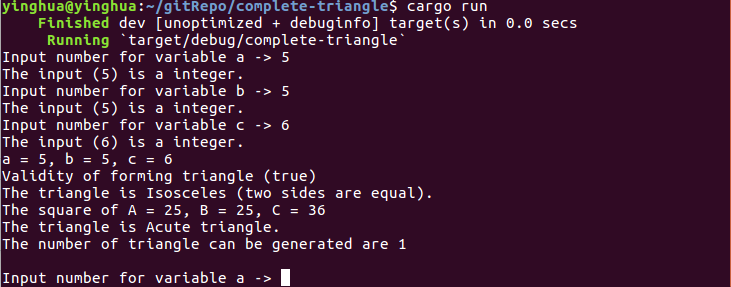

Complete Triangle
==================
> Program that determine **triangle types** and **number of possible number of triangles** can be generated with three inputs provided by user. 

*** 

Table Of Content 
================

* [Complete Triangle](#complete-triangle) 
* [Table Of Content](#table-of-content) 
* [Introduction](#introduction)
* [Infrastructure Setup and Installation](#infrastructure-setup-and-installation)
* [Highlight](#highlight)
  * [Software Resources](#software-resources)
  * [Screenshot](#screenshot)
* [About](#about)
  * [Contributor](#contributor)
  * [Status](#status)
  
*** 

Introduction
============
&nbsp;&nbsp;&nbsp;&nbsp;&nbsp;&nbsp;Triangles can be classified by various properties and characteristic relating to their **angles and sides**. A triangle has **three sides and three angles** and these angles always add to **180°**.  

The type of triangle can be classify whether there are:  
1. Scalene (all sides are different)  
2. Isosceles (two sides are equal)  
3. Equilateral (all three sides are equal)  

Pythagorean Theorem can be used to determine whether the triangle is: 
1. Right Angle  (a^2 * b^2 = c^2) 
2. Acute Angle  (a^2 * b^2 > c^2)
3. Obtuse Angle (a^2 * b^2 < c^2)  

*** 

Infrastructure Setup and Installation
=====================================
1. Download and install Rust compiler according to [official Rust documentation](https://www.rust-lang.org/en-US/install.html).  

2. Clone the sourcecode from Git: 
``` sh 
$ git clone https://github.com/CodesAreHonest/complete-triangle.git
``` 

3. Change directory to the cloned repository: 
``` sh 
$ cd complete-triangle
```

4. Compile and run the sourcecode with Cargo: 
``` sh 
$ cargo build 
   Compiling complete-triangle v0.1.0 (file:<directory>)
    Finished dev [unoptimized + debuginfo] target(s) in 2.3 secs
$ cargo run 
    Finished dev [unoptimized + debuginfo] target(s) in 0.0 secs
     Running `target/debug/complete-triangle`
Input number for variable a -> 
``` 

5. The program is running when it required to user to input number for three variables. The program only accepts integer as input in order to determine whether the three variables obtain are valid to form a triangle. 


Highlight
=========
Software Resources
-------------------
1. RustDT Eclipse IDE Plugin  
2. Git  
3. GDB Debugger  
4. Eclipse for Parallel Application Developers IDE  
5. Rust Compiler 1.20.0 

Screenshot
----------
The image below is the screenshot of the program. 
<p align="center"></p>

About 
=====
Contributor
-----------
- **Chai Ying Hua** 

Status 
------
This repository is still developing and maintaining as pet project. 


